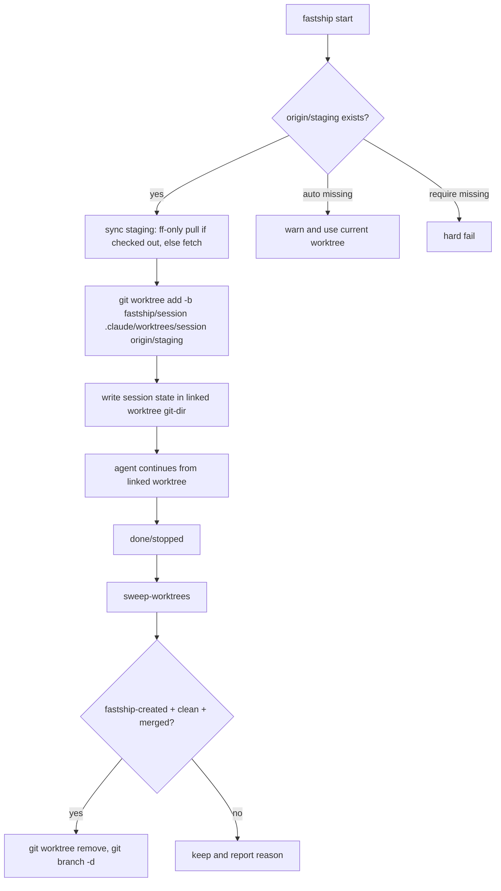

# Fastship Worktree Branch Management Implementation Plan

> **For agentic workers:** REQUIRED SUB-SKILL: Use superpowers:subagent-driven-development (recommended) or superpowers:executing-plans to implement this plan task-by-task. Steps use checkbox (`- [ ]`) syntax for tracking.

**Goal:** Make fastship start new feature sessions from a staging-based isolated worktree and provide safe cleanup so completed work does not leave dirty working-tree artifacts.

**Architecture:** Put branch/worktree lifecycle in `skills/fastship/orchestrator.py`, not the bash wrapper. `start` first synchronizes `staging` safely: if `staging` is checked out in any worktree, it runs `git pull --ff-only origin staging` there; otherwise it fetches `origin/staging`. It then creates `.claude/worktrees/<session>` with branch `fastship/<session>`, writes session state inside that worktree git-dir, and records the base ref. Cleanup is explicit and conservative: only fastship-created, done/stopped, clean worktrees whose HEAD is merged into the recorded base ref are removed.

**Tech Stack:** Python stdlib, git CLI, pytest real-git fixtures, existing fastship state helpers.

---

## 验收清单（AC）→ E2E 映射

| AC | 可观察断言 | E2E scenario |
|---|---|---|
| AC1: `start` creates feature worktree from `origin/staging` when available | Worktree contains a file that exists only on staging; saved state branch is `fastship/<session>` and base ref is `origin/staging` | `TestFastshipWorktreeLifecycle.test_start_creates_isolated_worktree_from_origin_staging` |
| AC2: `start` does not dirty the main worktree with `.claude/worktrees/` | `git status --short` in main is empty after start | `TestFastshipWorktreeLifecycle.test_start_creates_isolated_worktree_from_origin_staging` |
| AC3: cleanup removes only fastship-owned completed clean merged worktrees | Done clean worktree disappears and branch is safely deleted | `TestFastshipWorktreeLifecycle.test_sweep_removes_done_clean_merged_fastship_worktree` |
| AC4: cleanup preserves dirty worktrees | Dirty scratch file remains byte-for-byte | `TestFastshipWorktreeLifecycle.test_sweep_keeps_dirty_fastship_worktree` |
| AC5: installed projects ignore fastship runtime artifacts | `.gitignore` contains `.claude/worktrees/` and `.claude/.fastship-codex-review.md` after source-link install | `test_source_link_install_replaces_copied_engine_files` |

## File Structure

| File | Responsibility | Change |
|---|---|---|
| `skills/fastship/orchestrator.py` | CLI state machine plus hook logic | Modify |
| `skills/fastship/scripts/install_source_link.py` | Source-linked installer for consumer repos | Modify |
| `.gitignore` | Ignore local fastship runtime artifacts in this repo | Modify |
| `skills/fastship/SKILL.md` | User-facing fastship workflow docs | Modify |
| `.claude/commands/fastship.md` | Tracked slash-command mirror | Modify |
| `skills/fastship/INSTALL.md` | Installation ignore guidance | Modify |
| `tests/fastship/test_orchestrator.py` | Real-git lifecycle regression tests | Test |
| `tests/fastship/test_source_link_install.py` | Installer regression test | Test |

## 图示

### Task 1: Real-Git Start Regression

**Files:**
- Modify: `tests/fastship/test_orchestrator.py`

- [ ] **Step 1: Write a staging-only fixture**

Create a helper that initializes `main`, creates `staging`, adds `staging-only.txt`, and writes `refs/remotes/origin/staging`.

- [ ] **Step 2: Assert `cmd_start` creates a staging-derived worktree**

Run `orchestrator.cmd_start("test staging worktree", ["--no-fetch"])` with `FASTSHIP_SESSION=feature-branch-lifecycle`. Assert `.claude/worktrees/feature-branch-lifecycle/staging-only.txt` exists and saved `orchestrator.json` records `branch=fastship/feature-branch-lifecycle`, `repo_root=<worktree>`, and `base_ref=origin/staging`.

- [ ] **Step 3: Assert main worktree stays clean**

Run `git status --short` in the main repo. Expected output is an empty string.

### Task 2: Worktree Creation and State Binding

**Files:**
- Modify: `skills/fastship/orchestrator.py`

- [ ] **Step 1: Add start option parsing**

Add `parse_start_args()` so `start --base staging "<需求>"` and `start "<需求>" --base staging` both pass `requirement` and option argv correctly to `cmd_start`.

- [ ] **Step 2: Resolve base ref**

Implement `_resolve_base_ref(root, base_branch, fetch=True)` with candidate order `origin/<base>`, then `<base>`. Best-effort sync must run `git pull --ff-only origin <base>` only inside a worktree that already has `<base>` checked out; otherwise use `git fetch origin <base>` so staging is not merged into the current branch.

- [ ] **Step 3: Create the worktree before state snapshot**

Implement `_create_session_worktree()` and call it before `empty_orchestrator_state()`. On success, temporarily set `FASTSHIP_REPO_ROOT=<worktree>` while saving orchestrator/gate state so `_current_branch()`, `_repo_root()`, and `_git_head_sha()` describe the feature worktree.

### Task 3: Runtime Artifact Hygiene

**Files:**
- Modify: `skills/fastship/orchestrator.py`
- Modify: `.gitignore`
- Modify: `skills/fastship/scripts/install_source_link.py`
- Modify: `tests/fastship/test_source_link_install.py`

- [ ] **Step 1: Add local exclude fallback**

Write `.claude/worktrees/`, `.claude/state/`, `.claude/fastship-e2e-result.json`, and `.claude/.fastship-*.md` entries to `.git/info/exclude` before creating a worktree.

- [ ] **Step 2: Add tracked ignore rules**

Add the same fastship runtime artifact patterns to this repo `.gitignore`.

- [ ] **Step 3: Update source-link installer**

Add `_merge_gitignore()` to append the fastship ignore block to consumer project `.gitignore` and test that `.claude/worktrees/` plus `.claude/.fastship-codex-review.md` are present after install.

### Task 4: Safe Cleanup

**Files:**
- Modify: `skills/fastship/orchestrator.py`
- Modify: `tests/fastship/test_orchestrator.py`

- [ ] **Step 1: Implement fastship-owned sweep**

Add `sweep_fastship_worktrees(root, dry_run=False, prune=False)` that scans git worktrees, loads done/stopped fastship state from each linked worktree git-dir, and only removes worktrees whose state has `worktree.created_by_fastship=true`.

- [ ] **Step 2: Enforce safety predicates**

Before removal require non-main, not current path, clean `git status --porcelain`, and `git merge-base --is-ancestor <head> <base_ref>`. Use `git worktree remove` without `--force` and `git branch -d` for branch deletion.

- [ ] **Step 3: Expose CLI command**

Add `fastship sweep-worktrees [--dry-run]` and document it in `SKILL.md` plus `.claude/commands/fastship.md`.

### Task 5: Verification

**Files:**
- Test: `tests/fastship/test_orchestrator.py`
- Test: `tests/fastship/test_source_link_install.py`
- Test: `tests/forge/test_worktree_cleanup.py`
- Test: `tests/forge/test_forge_gate.py`

- [ ] **Step 1: Run py_compile**

Run: `python3 -m py_compile skills/fastship/orchestrator.py skills/fastship/scripts/install_source_link.py`
Expected: exit 0.

- [ ] **Step 2: Run fastship tests**

Run: `env -u FASTSHIP_REPO_ROOT -u FASTSHIP_STATE_HOME -u FASTSHIP_SESSION python3 -m pytest tests/fastship -q`
Expected: all tests pass.

- [ ] **Step 3: Run Forge cleanup/gate regression**

Run: `env -u FASTSHIP_REPO_ROOT -u FASTSHIP_STATE_HOME -u FASTSHIP_SESSION python3 -m pytest tests/forge/test_worktree_cleanup.py tests/forge/test_forge_gate.py -q`
Expected: all tests pass.

## Self-Review

- **Spec coverage:** AC1/AC2 cover staging checkout and no main dirty state; AC3/AC4 cover safe cleanup; AC5 covers installed project artifact hygiene.
- **Placeholder scan:** No TBD/TODO/implement-later placeholders remain.
- **Type consistency:** Worktree metadata keys are `created_by_fastship`, `path`, `branch`, `base_branch`, `base_ref`, and `main_repo_root`; cleanup reads the same keys.
