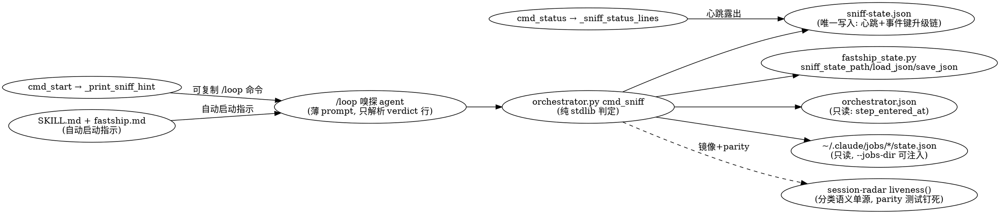

# Fastship /loop 嗅探 Agent（后台存活监控 + 假死软 Resume + 升级通知）Implementation Plan

> **For agentic workers:** REQUIRED SUB-SKILL: Use superpowers:subagent-driven-development (recommended) or superpowers:executing-plans to implement this plan task-by-task. Steps use checkbox (`- [ ]`) syntax for tracking.

**Goal:** fastship start 后为 session 配备 /loop 嗅探 agent：纯 stdlib 的 `sniff` 子命令基于双权威信号（bg-job state + per-step 停留时长）判定假死，先软 resume 一次、再升级通知用户，全程对引擎 state 只读、嗅探心跳在 status 可见。

**Architecture:** 嗅探判定 100% 在 `orchestrator.py` 新增的 `cmd_sniff` 内完成（零 LLM、零写引擎 state），输出单行机器可读 `[FASTSHIP_SNIFF]` verdict；/loop agent 每轮只跑这一条命令并按 verdict 行动（resume=软唤醒、notify=转发证据链、session_done=自停）。「自动」落地为 skill 指令层：SKILL.md/fastship.md 指示驱动 agent 在 start 后立即后台启动嗅探 loop，CLI 模式降级为手动粘贴 start 打印的可复制命令。resume/通知按**事件键 (step, 信号, 事件标识)** 去重——bg 事件标识=job id、step_stale 事件标识=本次 entered_at（刷新即自动开新链）——计数持久化在新的 `sniff-state.json`（同 session 目录，嗅探唯一可写文件）。

**Tech Stack:** Python 3 stdlib（json/os/datetime，判定路径零 subprocess）、pytest、现有 fastship_state 原子写/路径层、E2E runner 套路（`e2e[_-]?runner` 命名 + scenarios→rounds→turns 结果）。

---

## 设计决策（1B 技术法庭 4 fork 裁决 + codex review round-1 两项硬化，全部 adopted，无 open fork）

1. **liveness 复用方式 = 源内镜像 + parity 测试钉死**（不跨 skill import、不抽共享模块）。fastship 是单文件分发到消费仓库（aifriends 安装版无 session-radar 目录），运行时 import 在消费侧必然 ImportError；抽共享模块要改 session-radar，扩大改动面。镜像 ~10 行分类常量/函数，AC-REUSE-1 的 parity 单测在源仓库逐项断言与 `session_dashboard.liveness()` 行为一致，语义漂移测试当场红。
2. **软 resume 通道 = sniff 纯信号，执行权在 /loop agent**。sniff 只输出 `action=resume` + 证据链；loop agent（有会话/SendMessage 能力）向驱动 session 注入一次继续指令。sniff 自己绝不 shell 出 `claude -p`（KNOWLEDGE 已记录其四类事故模式），保持零副作用。
3. **per-step entered_at 形态 = 全步历史 dict**（`orch["step_entered_at"][step_id] = iso`）。AC-TS-1 要求多步时间戳可比对；rewind 重入覆盖单 key 即计时复位；纯增量字段，旧 session 无此 key 不影响任何现有读路径。
4. **stalled 阈值 = phase 级宽默认 + 豁免表 + 配置可调**（不做 19 步硬编码假精度）。Phase1 1800s / Phase2&3 3600s；设计上等人的步骤（1.5 grill / 1.6 用户确认 / 3.5 loop 决策）永不判 stalled；`fastship.project.json` 的 `sniff` 段可按 step 覆盖阈值、可调 `interval_s`（hint 与 status stale 判定同源使用）。误报是头号产品风险（1A product-2），宁可宽。
5. **【codex round-1/2】升级链去重粒度 = 事件键 + 非饿死选择**：行动永远选候选队列（step_stale 优先，其后每个 blocked job）中第一个「升级链未走完」的事件——已 notified 的旧事件绝不遮蔽新事件（round-2 starvation 修复）。`events` dict 以 `{step}|{signal}|{事件标识}` 为 key。step_stale 的事件标识 = 本次 entered_at 字符串——rewind/重入刷新 entered_at 后 key 自动变化、新链自动开启，零显式 reset 逻辑；bg_state 的事件标识 = job id——不同 job 各走独立升级链，绝不被旧事件的 notified 吞掉。同一 blocked job 终身一链（updatedAt 会被 daemon 心跳刷新，进 key 会造成 resume 风暴，故不进 key）。
6. **【codex round-1】--shared 同根多 session 的 bg 归属 = 保守跳过**。bg job 只有 cwd 可归属；两个活跃 session 同根（--shared 或同 worktree）时归属不可分辨——嗅探检测到其他活跃 session 同根即跳过 bg 告警（输出 `note=bg_shared_root`），绝不替别的 session 行动；step_stale 信号不受影响。worktree-per-session 是 fastship 默认隔离，同根是显式 opt-in 的已知边界。

## File Structure

| File | Responsibility | Change |
|------|----------------|--------|
| `skills/fastship/fastship_state.py` | 新增 `sniff_state_path()`（同 session 目录 sniff-state.json，reset 删 session 目录自然回收） | Modify |
| `skills/fastship/orchestrator.py` | 改动主体：per-step entered_at 戳（`_stamp_step_entry` + 4 个推进入口）；bg 分类镜像（`_classify_bg_state`/`_scan_bg_jobs`）；`cmd_sniff` 子命令（双信号判定、事件键升级链、共享根保守跳过、心跳、单行 verdict）；`_parse_sniff_line`/`_iso_age_s`/`_sniff_interval_s` helper；`_print_sniff_hint`（start 输出可复制 /loop 命令，环境前缀完整可执行）；`_sniff_status_lines`（status 心跳露出）；main() 分发 + usage | Modify |
| `skills/fastship/SKILL.md` | 嗅探段：start 后驱动 agent 自动后台启动嗅探 loop 的指示 + CLI 降级 + resume/notify/stop 语义 | Modify |
| `.claude/commands/fastship.md` | 与 SKILL.md 同步的自动启动嗅探指示段 | Modify |
| `tests/fastship/test_orchestrator.py` | 新增 TestSniffStatePath / TestStepEnteredAt / TestSniffClassify / TestSniffLivenessParity / TestSniff / TestSniffHint / TestSniffStatusLines / TestSniffDocs 测试类 | Test |
| `tests/fastship/sniff_e2e_runner.py` | E2E runner：tmp state home 真实 start→真实推进→fixture 注入→subprocess 跑 sniff；产出 **15 个真实 scenario 记录**（与 ac_mapping 名称一一对应）的 e2e_result.json | Create |

## 图示

```mermaid
flowchart TD
    A[/loop agent 每 interval_s 唤醒/] --> B[跑 orchestrator.py sniff\n纯 stdlib 零 LLM]
    B --> C{读 orchestrator.json\n只读!}
    C -->|无 session| Z1[verdict=no_session\naction=stop_loop → loop 自停]
    C -->|step done/stopped| Z2[verdict=session_done\naction=stop_loop → loop 自停]
    C --> D{信号 1: step 停留时长\nentered_at + phase 阈值\n豁免: 1.5/1.6/3.5}
    C --> E{信号 2: 本 session bg job\nstate=blocked?\n自我排除 + cwd 归属\n同根多 session → 保守跳过}
    D -->|未超阈| F[verdict=ok action=none]
    E -->|无 blocked| F
    D -->|超阈 事件=step|step_stale|entered_at| G{sniff-state.json\nevents 事件键升级链}
    E -->|blocked 事件=step|bg_state|job_id| G
    G -->|attempts=0| H[action=resume 写 attempts=1\nloop agent 软唤醒驱动 session\n绝不 kill 进程]
    G -->|attempts=1 未通知| I[action=notify_user + 证据链\nloop agent 通知用户]
    G -->|已通知| J[verdict=stalled_notified\naction=none 静默\n新事件=新 key 自动重开链]
    B --> K[每轮写心跳 last_check_at\nfastship status 露出/超龄⚠️]
```



## 验收清单（AC）→ E2E 映射

E2E scenario 名称即 `sniff_e2e_runner.py` 产出 result JSON 中 `scenarios[].name` 的**真实记录**（15 个），一一对应：

| AC | 可观察断言 | E2E scenario |
|----|-----------|--------------|
| AC-SNIFF-1 | 健康 session sniff 输出恰好一行 [FASTSHIP_SNIFF]，含 session/step/verdict=ok，exit 0 | e2e_healthy_sniff |
| AC-SNIFF-2 | 分类只依赖 state 字段（无 state.json→unknown 在单元/parity 层钉死；E2E 观察可归属 unknown 的 jobs_unknown 计数），mtime 双向证伪不影响分类 | e2e_bg_classify_no_mtime |
| AC-SNIFF-3 | 回拨 entered_at 超阈值 → verdict=stalled + 四个 evidence 字段 | e2e_step_stale_evidence |
| AC-SNIFF-4 | 跨 ok/resume/notify 三路径前后 orchestrator.json+gate.json sha256 不变，sniff-state.json 出现 | e2e_readonly_hash_sandwich |
| AC-TS-1 | classify+done 真实推进（断言 rc=0 且 step 实际变化），新 step entered_at 落盘且单调递增 | e2e_step_ts_monotonic |
| AC-START-1 | start stdout 含嗅探 hint：本次真实 session id + /loop + interval；**抠出内嵌命令原样 bash -c 执行**，输出合法 verdict 行 | e2e_start_hint_executable |
| AC-START-2 | SKILL.md 与 fastship.md 同段共现「start 成功后…自动…启动嗅探 loop」锚点 + 手动粘贴降级说明 | e2e_docs_anchor |
| AC-RESUME-1 | 同一事件连跑 5 次：action 序列 resume→notify_user→none×3，events 该键 attempts 恒 1（每次独立 subprocess） | e2e_escalation_dedup |
| AC-RESUME-2 | notify_user 行证据链 signal/stalled_since/stalled_s/resume_at 字段值与 fixture 注入值对账；**bg_state 与 step_stale 两种信号源分别验证** | e2e_evidence_chain + e2e_escalation_dedup |
| AC-NOTIFY-1 | notified 落盘 + 后续轮 stalled_notified；**反向 case：新 blocked job（新事件键）在旧事件 notified 后仍重新走 resume 链** | e2e_notify_dedup |
| AC-HB-1 | 两次 sniff 夹 sleep，last_check_at 严格递增 | e2e_heartbeat_advances |
| AC-HB-2 | status 三态：未启动提示 / 健康心跳行 / 回拨心跳后 ⚠️ watchdog stale | e2e_status_heartbeat_3states |
| AC-REUSE-1 | 5 类 bg fixture 喂 importlib 加载的 session_dashboard.liveness() 与 sniff 分类，逐项一致 | e2e_liveness_parity |
| AC-STOP-1 | session 终态 → verdict=session_done action=stop_loop；start hint 含停止指示 | e2e_session_done_stops |
| AC-SCOPE-1 | 同根 --shared session → bg 保守跳过（note=bg_shared_root）；**异根 session 的 blocked job 互不可见（B 自己的 sniff 报警，A 不报）**；自我签名 job 排除（带对照组） | e2e_scope_isolation |

---

### Task 1: fastship_state.sniff_state_path

**Files:**
- Modify: `skills/fastship/fastship_state.py:315-320`（gate_state_path 旁）
- Test: `tests/fastship/test_orchestrator.py`

- [ ] **Step 1: Write the failing test**

```python
class TestSniffStatePath:
    def test_sniff_state_path_in_session_dir(self, monkeypatch, tmp_path):
        monkeypatch.setenv("FASTSHIP_STATE_HOME", str(tmp_path))
        monkeypatch.setenv("FASTSHIP_SESSION", "sess-a")
        p = fastship_state.sniff_state_path()
        assert p == os.path.join(str(tmp_path), "sessions", "sess-a", "sniff-state.json")
        assert os.path.dirname(p) == os.path.dirname(fastship_state.gate_state_path())
```

- [ ] **Step 2: Run test to verify it fails**

Run: `python3 -m pytest tests/fastship/test_orchestrator.py::TestSniffStatePath -v`
Expected: FAIL with `AttributeError: ... has no attribute 'sniff_state_path'`

- [ ] **Step 3: Write minimal implementation** — 在 `gate_state_path`（fastship_state.py:315-316）之后插入：

```python
def sniff_state_path(session_id: str = None) -> str:
    """嗅探（sniff 子命令）的自有状态：心跳 + 事件键 resume/notify 升级链。
    与 orchestrator.json/gate.json 同 session 目录 —— sniff 对那两个文件严格只读，
    这是它唯一可写的文件；reset 删 session 目录时自然回收。"""
    return os.path.join(session_state_dir(session_id), "sniff-state.json")
```

- [ ] **Step 4: Run test to verify it passes**

Run: `python3 -m pytest tests/fastship/test_orchestrator.py::TestSniffStatePath -v`
Expected: PASS

- [ ] **Step 5: Commit**

```bash
git add skills/fastship/fastship_state.py tests/fastship/test_orchestrator.py
git commit -m "feat(fastship): sniff_state_path — 嗅探自有状态文件路径(同 session 目录)"
```

### Task 2: per-step entered_at 时间戳（AC-TS-1）

**Files:**
- Modify: `skills/fastship/orchestrator.py:127-143`（empty_orchestrator_state）、`:2571-2616`（_advance_state）、`:2619-2655`（_handle_loop_decision）
- Test: `tests/fastship/test_orchestrator.py`

- [ ] **Step 1: Write the failing tests**

```python
class TestStepEnteredAt:
    def test_empty_state_stamps_first_step(self):
        st = empty_orchestrator_state("x")
        assert "1.0" in st["step_entered_at"]
        datetime.fromisoformat(st["step_entered_at"]["1.0"])  # 合法 ISO

    def test_advance_stamps_each_new_step_monotonic(self):
        st = empty_orchestrator_state("x")
        st["request_type"] = "feature"
        prev_ts = st["step_entered_at"]["1.0"]
        for _ in range(3):
            st = _advance_state(st)
            cur = st["current_step"]
            assert cur in st["step_entered_at"]
            assert st["step_entered_at"][cur] >= prev_ts  # ISO 字典序=时间序
            prev_ts = st["step_entered_at"][cur]

    def test_loop_continue_restamps_2_5(self):
        st = empty_orchestrator_state("x")
        st["current_step"] = "3.5"
        st["loop_count"] = 1
        st["artifacts"] = {"loop_decision": "continue"}
        st["step_entered_at"]["2.5"] = "2000-01-01T00:00:00"
        _handle_loop_decision(st)
        assert st["current_step"] == "2.5"
        assert st["step_entered_at"]["2.5"] > "2020-01-01"  # rewind 重置计时，防回退步秒级误报
```

- [ ] **Step 2: Run tests to verify they fail**

Run: `python3 -m pytest tests/fastship/test_orchestrator.py::TestStepEnteredAt -v`
Expected: FAIL with `KeyError: 'step_entered_at'`

- [ ] **Step 3: Implement** — 三处改动：

(a) `empty_orchestrator_state`（orchestrator.py:142 `"artifacts": {}` 之前）加一行：

```python
        "step_entered_at": {"1.0": datetime.now().isoformat()},
```

(b) `_advance_state` 上方新增 helper，并在两个出口打戳——`orch["current_step"] = candidate.id` / `orch["phase"] = candidate.phase`（:2611-2612）之后、`return orch` 之前插 `_stamp_step_entry(orch)`；`orch["current_step"] = "done"`（:2615）之后插 `_stamp_step_entry(orch)`：

```python
def _stamp_step_entry(orch: dict):
    """记录进入当前 step 的时刻（sniff 的 step-staleness 信号源）。重入同一 step
    覆盖该 key —— 计时复位正是 loop rewind 后想要的语义；entered_at 同时是
    step_stale 升级链的事件标识，刷新即自动开新链。引擎写自己的 state，
    与「sniff 对引擎 state 只读」不冲突。"""
    orch.setdefault("step_entered_at", {})[orch["current_step"]] = datetime.now().isoformat()
```

(c) `_handle_loop_decision` 四处 `current_step` 直改后各补 `_stamp_step_entry(orch)`：:2625（loop 上限 stopped）、:2639-2640（continue 回 2.5，在 `orch["phase"] = 2` 后）、:2645-2646（escalate 回 1.0，在 `orch["phase"] = 1` 后；注意 escalate 清空 artifacts 不清 step_entered_at——它在 orch 顶层）、:2652（stop → stopped）。

- [ ] **Step 4: Run tests to verify they pass**

Run: `python3 -m pytest tests/fastship/test_orchestrator.py::TestStepEnteredAt -v`
Expected: PASS

- [ ] **Step 5: 跑全量现有测试防回归**

Run: `python3 -m pytest tests/fastship/ -q 2>&1 | tail -3`
Expected: 全绿（纯增量字段不碰旧读路径）

- [ ] **Step 6: Commit**

```bash
git add skills/fastship/orchestrator.py tests/fastship/test_orchestrator.py
git commit -m "feat(fastship): per-step entered_at 时间戳 — 4 个推进入口单点打戳(AC-TS-1)"
```

### Task 3: bg-state 分类镜像 + parity（AC-SNIFF-2 / AC-REUSE-1）

**Files:**
- Modify: `skills/fastship/orchestrator.py`（CLI Commands 段前的 helper 区）
- Test: `tests/fastship/test_orchestrator.py`

- [ ] **Step 1: Write the failing tests**

```python
class TestSniffClassify:
    @pytest.mark.parametrize("state,expected", [
        ("active", "working"), ("running", "working"), ("in_progress", "working"),
        ("blocked", "blocked"), ("waiting", "blocked"), ("paused", "blocked"),
        ("done", "done"), ("completed", "done"), ("finished", "done"), ("stopped", "done"),
        (None, "unknown"), ("", "unknown"), ("wibble", "unknown"),
    ])
    def test_classify(self, state, expected):
        assert _classify_bg_state(state) == expected

    def test_scan_jobs_missing_state_json_is_unknown_not_crash(self, tmp_path):
        (tmp_path / "j1").mkdir()
        (tmp_path / "j1" / "state.json").write_text('{"state": "blocked", "intent": "x", "cwd": "/r"}')
        (tmp_path / "j2").mkdir()  # 无 state.json
        (tmp_path / "j3").mkdir()
        (tmp_path / "j3" / "state.json").write_text("{corrupt")
        jobs = _scan_bg_jobs(str(tmp_path))
        assert jobs["j1"]["state"] == "blocked" and jobs["j1"]["cwd"] == "/r"
        assert jobs["j2"]["state"] is None and jobs["j3"]["state"] is None

class TestSniffLivenessParity:
    def test_parity_with_session_radar(self):
        import importlib.util
        sd_path = os.path.join(os.path.dirname(__file__), "..", "..",
                               "skills", "session-radar", "session_dashboard.py")
        spec = importlib.util.spec_from_file_location("session_dashboard", sd_path)
        sd = importlib.util.module_from_spec(spec)
        spec.loader.exec_module(sd)
        for state in ["active", "running", "in_progress", "blocked", "waiting", "paused",
                      "done", "completed", "finished", "stopped", None, "", "wibble"]:
            assert _classify_bg_state(state) == sd.liveness(0, is_bg=True, bg_state=state), \
                f"divergence on {state!r} — 单源被破坏(ops-6)"
```

- [ ] **Step 2: Run tests to verify they fail**

Run: `python3 -m pytest tests/fastship/test_orchestrator.py::TestSniffClassify tests/fastship/test_orchestrator.py::TestSniffLivenessParity -v`
Expected: FAIL with `NameError: _classify_bg_state`

- [ ] **Step 3: Implement** — orchestrator.py 中（建议放在 format_status 附近的 helper 区）：

```python
# ── Sniff（后台存活监控）────────────────────────────────────────────────────
# session-radar bg 分类的源内镜像（session_dashboard.py:191-193 + liveness() bg 分支）。
# 写成字面量是因为引擎单文件分发到消费仓库（无 session-radar 可 import）；语义单源由
# TestSniffLivenessParity 对活体 session_dashboard 逐项钉死，漂移当场红。
# 🔴 绝不读 mtime —— bg job 两轮间静默是常态（KNOWLEDGE 教训），实现里不存在 dead 分类。
SNIFF_BG_ALIVE = ("active", "running", "in_progress")
SNIFF_BG_WAIT = ("blocked", "waiting", "paused")
SNIFF_BG_DONE = ("done", "completed", "finished", "stopped")


def _classify_bg_state(bg_state) -> str:
    s = str(bg_state).lower() if bg_state else ""
    if s in SNIFF_BG_ALIVE:
        return "working"
    if s in SNIFF_BG_WAIT:
        return "blocked"
    if s in SNIFF_BG_DONE:
        return "done"
    return "unknown"


def _scan_bg_jobs(jobs_dir: str) -> dict:
    """仿 session_dashboard.bg_jobs()：state.json 缺失/损坏不崩（state=None→unknown）。"""
    out = {}
    try:
        entries = os.listdir(jobs_dir)
    except OSError:
        return out
    for d in entries:
        p = os.path.join(jobs_dir, d)
        if not os.path.isdir(p):
            continue
        info = {"state": None, "intent": None, "cwd": None, "updated_at": None}
        sp = os.path.join(p, "state.json")
        if os.path.exists(sp):
            try:
                with open(sp, encoding="utf-8") as f:
                    s = json.load(f)
                info["state"] = s.get("state")
                info["intent"] = s.get("intent")
                info["cwd"] = s.get("cwd") or s.get("originCwd")
                info["updated_at"] = s.get("updatedAt")
            except Exception:
                pass
        out[d] = info
    return out
```

- [ ] **Step 4: Run tests to verify they pass**

Run: `python3 -m pytest tests/fastship/test_orchestrator.py::TestSniffClassify tests/fastship/test_orchestrator.py::TestSniffLivenessParity -v`
Expected: PASS

- [ ] **Step 5: Commit**

```bash
git add skills/fastship/orchestrator.py tests/fastship/test_orchestrator.py
git commit -m "feat(fastship): bg-state 分类镜像 session-radar + parity 测试钉死单源(AC-SNIFF-2/AC-REUSE-1)"
```

### Task 4: cmd_sniff 核心（AC-SNIFF-1/3/4、AC-RESUME-1/2、AC-NOTIFY-1、AC-HB-1、AC-STOP-1、AC-SCOPE-1）

**Files:**
- Modify: `skills/fastship/orchestrator.py`（Task 3 的 Sniff 段之后）
- Test: `tests/fastship/test_orchestrator.py`

- [ ] **Step 1: Write the failing tests**（核心升级链 + 事件键 + 只读性 + 共享根；E2E 层在 Task 7 用 subprocess 再验一遍）

```python
def _mk_session(tmp_path, monkeypatch, sid="sniff-t", step="2.0", entered_offset_s=0):
    """真实形状的 session fixture：经 empty_orchestrator_state 构造再落盘。"""
    monkeypatch.setenv("FASTSHIP_STATE_HOME", str(tmp_path / "home"))
    monkeypatch.setenv("FASTSHIP_SESSION", sid)
    st = empty_orchestrator_state("sniff fixture")
    st["session_id"] = sid
    st["current_step"] = step
    st["phase"] = 2
    entered = datetime.now() - timedelta(seconds=entered_offset_s)
    st["step_entered_at"][step] = entered.isoformat()
    fastship_state.save_json(fastship_state.orchestrator_state_path(sid), st)
    fastship_state.save_json(fastship_state.gate_state_path(sid), {"test_passed": False})
    return st


def _sniff_once(tmp_path, capsys):
    cmd_sniff(["--jobs-dir", str(tmp_path / "jobs")])
    lines = [l for l in capsys.readouterr().out.splitlines()
             if l.startswith("[FASTSHIP_SNIFF]")]
    assert len(lines) == 1
    return _parse_sniff_line(lines[0])


class TestSniff:
    def test_parse_sniff_line(self):
        d = _parse_sniff_line("[FASTSHIP_SNIFF] session=a step=2.0 verdict=ok action=none jobs_checked=0")
        assert d == {"session": "a", "step": "2.0", "verdict": "ok",
                     "action": "none", "jobs_checked": "0"}
        assert _parse_sniff_line("not a sniff line") == {}

    def test_healthy_ok_single_line(self, tmp_path, monkeypatch, capsys):
        _mk_session(tmp_path, monkeypatch)
        d = _sniff_once(tmp_path, capsys)
        assert d["session"] == "sniff-t" and d["step"] == "2.0"
        assert d["verdict"] == "ok" and d["action"] == "none"

    def test_escalation_resume_notify_silent(self, tmp_path, monkeypatch, capsys):
        st = _mk_session(tmp_path, monkeypatch, entered_offset_s=99999)  # >3600s 阈值
        actions = [_sniff_once(tmp_path, capsys) for _ in range(5)]
        assert [a["action"] for a in actions] == ["resume", "notify_user", "none", "none", "none"]
        assert actions[0]["verdict"] == "stalled" and actions[2]["verdict"] == "stalled_notified"
        n = actions[1]  # 证据链（AC-RESUME-2）
        assert n["signal"] == "step_stale" and "stalled_since" in n
        assert int(n["stalled_s"]) > 3600 and "resume_at" in n
        # 事件键计数持久化恒 1（AC-RESUME-1 防风暴）
        sniff = fastship_state.load_json(fastship_state.sniff_state_path())
        key = f"2.0|step_stale|{st['step_entered_at']['2.0']}"
        assert sniff["events"][key]["resume_attempts"] == 1
        assert sniff["events"][key]["notified"] is True

    def test_entered_at_refresh_opens_new_event_chain(self, tmp_path, monkeypatch, capsys):
        st = _mk_session(tmp_path, monkeypatch, entered_offset_s=99999)
        for _ in range(2):
            _sniff_once(tmp_path, capsys)            # resume → notify（事件 1 关链）
        # 模拟 rewind 重入：引擎刷新 entered_at（fixture builder 身份），又一次假死
        st["step_entered_at"]["2.0"] = (datetime.now() - timedelta(seconds=88888)).isoformat()
        fastship_state.save_json(fastship_state.orchestrator_state_path(), st)
        d = _sniff_once(tmp_path, capsys)
        assert d["action"] == "resume"               # 新事件键 → 新链（AC-NOTIFY-1 反向）

    def test_new_blocked_job_after_notified_opens_new_chain(self, tmp_path, monkeypatch, capsys):
        st = _mk_session(tmp_path, monkeypatch)
        jobs = tmp_path / "jobs"
        (jobs / "j1").mkdir(parents=True)
        (jobs / "j1" / "state.json").write_text(json.dumps(
            {"state": "blocked", "intent": "cargo build", "cwd": st["repo_root"],
             "updatedAt": "2026-06-11T00:00:00"}))
        a1 = _sniff_once(tmp_path, capsys)
        a2 = _sniff_once(tmp_path, capsys)
        assert (a1["action"], a2["action"]) == ("resume", "notify_user")
        assert a2["signal"] == "bg_state" and a2["stalled_since"] == "2026-06-11T00:00:00"
        assert a2["job"] == "j1" and "resume_at" in a2
        a25 = _sniff_once(tmp_path, capsys)          # j1 链已走完 → 静默
        assert a25["verdict"] == "stalled_notified"
        # 🔴 j1 保持 blocked 在场（codex round-2 starvation case）：
        # 新 job 必须仍能开新链，不被已 notified 的旧事件遮蔽
        (jobs / "j2").mkdir()
        (jobs / "j2" / "state.json").write_text(json.dumps(
            {"state": "blocked", "intent": "psql migrate", "cwd": st["repo_root"]}))
        a3 = _sniff_once(tmp_path, capsys)
        assert a3["action"] == "resume" and a3["job"] == "j2"
        a4 = _sniff_once(tmp_path, capsys)
        assert a4["action"] == "notify_user" and a4["job"] == "j2"
        a5 = _sniff_once(tmp_path, capsys)           # 全部链走完 → 整体静默
        assert a5["verdict"] == "stalled_notified"
        # 🔴 防回归（codex round-4）：同一 blocked job 的 updatedAt 心跳变化
        # 绝不重开链（updatedAt 不在事件键里 —— 否则 resume 风暴）
        (jobs / "j2" / "state.json").write_text(json.dumps(
            {"state": "blocked", "intent": "psql migrate", "cwd": st["repo_root"],
             "updatedAt": datetime.now().isoformat()}))
        a6 = _sniff_once(tmp_path, capsys)
        assert a6["verdict"] == "stalled_notified" and a6["action"] == "none"

    def test_done_session_same_root_does_not_block_bg(self, tmp_path, monkeypatch, capsys):
        st = _mk_session(tmp_path, monkeypatch)
        done_s = empty_orchestrator_state("done one")
        done_s["session_id"] = "done-s"
        done_s["current_step"] = "done"              # 已终结的同根 session 不算共享
        done_s["repo_root"] = st["repo_root"]
        fastship_state.save_json(fastship_state.orchestrator_state_path("done-s"), done_s)
        jobs = tmp_path / "jobs"
        (jobs / "jb").mkdir(parents=True)
        (jobs / "jb" / "state.json").write_text(json.dumps(
            {"state": "blocked", "intent": "cargo build", "cwd": st["repo_root"]}))
        d = _sniff_once(tmp_path, capsys)
        assert d["action"] == "resume" and d["job"] == "jb"  # 对照组：正常告警

    def test_readonly_hash_sandwich(self, tmp_path, monkeypatch, capsys):
        _mk_session(tmp_path, monkeypatch, entered_offset_s=99999)
        op = fastship_state.orchestrator_state_path()
        gp = fastship_state.gate_state_path()
        h = lambda p: hashlib.sha256(open(p, "rb").read()).hexdigest()
        before = (h(op), h(gp))
        for _ in range(3):  # 覆盖 resume/notify/silent 三条有写诱惑的路径
            _sniff_once(tmp_path, capsys)
        assert (h(op), h(gp)) == before  # AC-SNIFF-4
        assert os.path.exists(fastship_state.sniff_state_path())

    def test_heartbeat_advances(self, tmp_path, monkeypatch, capsys):
        _mk_session(tmp_path, monkeypatch)
        _sniff_once(tmp_path, capsys)
        t1 = fastship_state.load_json(fastship_state.sniff_state_path())["last_check_at"]
        time.sleep(1.1)
        _sniff_once(tmp_path, capsys)
        t2 = fastship_state.load_json(fastship_state.sniff_state_path())["last_check_at"]
        assert t2 > t1  # AC-HB-1：严格递增，不是首写后不动

    def test_session_done_stops_loop(self, tmp_path, monkeypatch, capsys):
        _mk_session(tmp_path, monkeypatch, step="done")
        d = _sniff_once(tmp_path, capsys)
        assert d["verdict"] == "session_done" and d["action"] == "stop_loop"

    def test_exempt_step_never_stalled(self, tmp_path, monkeypatch, capsys):
        _mk_session(tmp_path, monkeypatch, step="1.6", entered_offset_s=999999)
        d = _sniff_once(tmp_path, capsys)
        assert d["verdict"] == "ok"  # 等用户确认的步骤永不假死

    def test_missing_step_ts_degrades_ok(self, tmp_path, monkeypatch, capsys):
        st = _mk_session(tmp_path, monkeypatch)
        st.pop("step_entered_at")  # 存量旧 session 无此字段
        fastship_state.save_json(fastship_state.orchestrator_state_path(), st)
        d = _sniff_once(tmp_path, capsys)
        assert d["verdict"] == "ok" and d.get("note") == "no_step_ts"  # 绝不误报

    def test_self_and_foreign_jobs_excluded(self, tmp_path, monkeypatch, capsys):
        st = _mk_session(tmp_path, monkeypatch)
        jobs = tmp_path / "jobs"
        (jobs / "jself").mkdir(parents=True)
        (jobs / "jself" / "state.json").write_text(json.dumps(
            {"state": "blocked", "intent": "FASTSHIP_SNIFF watch loop", "cwd": st["repo_root"]}))
        (jobs / "jother").mkdir()
        (jobs / "jother" / "state.json").write_text(json.dumps(
            {"state": "blocked", "intent": "x", "cwd": "/elsewhere/repo"}))
        d = _sniff_once(tmp_path, capsys)
        assert d["verdict"] == "ok" and d["jobs_checked"] == "0"  # 两个都不进判定

    def test_shared_root_skips_bg_attribution(self, tmp_path, monkeypatch, capsys):
        st = _mk_session(tmp_path, monkeypatch)
        # 第二个活跃 session 同根（--shared 场景）
        other = empty_orchestrator_state("other")
        other["session_id"] = "other-s"
        other["current_step"] = "2.0"
        other["repo_root"] = st["repo_root"]
        fastship_state.save_json(fastship_state.orchestrator_state_path("other-s"), other)
        jobs = tmp_path / "jobs"
        (jobs / "jamb").mkdir(parents=True)
        (jobs / "jamb" / "state.json").write_text(json.dumps(
            {"state": "blocked", "intent": "cargo build", "cwd": st["repo_root"]}))
        d = _sniff_once(tmp_path, capsys)
        assert d["verdict"] == "ok" and "bg_shared_root" in d.get("note", "")
```

测试文件顶部需补 import：`import hashlib, time` 与 `from datetime import timedelta`（按现有 import 风格并入）。

- [ ] **Step 2: Run tests to verify they fail**

Run: `python3 -m pytest tests/fastship/test_orchestrator.py::TestSniff -v`
Expected: FAIL with `NameError: cmd_sniff`

- [ ] **Step 3: Implement** — orchestrator.py 的 Sniff 段（Task 3 代码之后）追加：

```python
SNIFF_LINE_PREFIX = "[FASTSHIP_SNIFF]"
SNIFF_DEFAULT_INTERVAL_S = 240            # ≤270s：贴 prompt-cache 5min 窗口（1A constraints）
SNIFF_PHASE_THRESHOLDS_S = {1: 1800, 2: 3600, 3: 3600}
SNIFF_THRESHOLD_DEFAULT_S = 3600
SNIFF_EXEMPT_STEPS = ("1.5", "1.6", "3.5")  # 设计上等人的步骤：永不判 stalled
SNIFF_SELF_MARKER = "FASTSHIP_SNIFF"        # intent 带此签名的 bg job = 嗅探自身（防反馈环）


def _parse_sniff_line(line: str) -> dict:
    """[FASTSHIP_SNIFF] k=v 单行 → dict。loop agent 与测试共用的解析口径
    （[FASTSHIP_GOAL] 无解析测试的债不复制到这条线上）。"""
    if not line.startswith(SNIFF_LINE_PREFIX):
        return {}
    out = {}
    for tok in line[len(SNIFF_LINE_PREFIX):].split():
        if "=" in tok:
            k, v = tok.split("=", 1)
            out[k] = v
    return out


def _iso_age_s(now_dt, iso_str) -> int:
    try:
        dt = datetime.fromisoformat(str(iso_str).replace("Z", "+00:00"))
        if dt.tzinfo is not None:
            dt = dt.astimezone().replace(tzinfo=None)
        return max(0, int((now_dt - dt).total_seconds()))
    except (ValueError, TypeError):
        return 0


def _sniff_interval_s() -> int:
    cfg = fastship_state.load_project_config().get("sniff") or {}
    try:
        return int(cfg.get("interval_s", SNIFF_DEFAULT_INTERVAL_S))
    except (TypeError, ValueError):
        return SNIFF_DEFAULT_INTERVAL_S


def _sniff_step_threshold_s(step_id: str, phase) -> int:
    cfg = fastship_state.load_project_config().get("sniff") or {}
    per_step = cfg.get("thresholds") or {}
    if step_id in per_step:
        return int(per_step[step_id])
    if "threshold_default_s" in cfg:
        return int(cfg["threshold_default_s"])
    try:
        return SNIFF_PHASE_THRESHOLDS_S.get(int(phase), SNIFF_THRESHOLD_DEFAULT_S)
    except (TypeError, ValueError):
        return SNIFF_THRESHOLD_DEFAULT_S


def _other_active_session_shares_root(sid: str, roots: list) -> bool:
    """同 state home 下是否有其他活跃 session 与本 session 同根（--shared 场景）。
    同根时 bg job 的 cwd 归属不可分辨 —— 保守跳过 bg 告警，绝不替别的 session 行动
    （step_stale 信号不受影响）。纯只读扫描。"""
    try:
        sids = os.listdir(fastship_state.sessions_dir())
    except OSError:
        return False
    for other in sids:
        if other == sid:
            continue
        o = fastship_state.load_json(fastship_state.orchestrator_state_path(other))
        if not o or o.get("current_step") in ("done", "stopped", None):
            continue
        oroots = {o.get("repo_root"), (o.get("worktree") or {}).get("path")}
        if any(r in oroots for r in roots):
            return True
    return False


def cmd_sniff(argv: list = None) -> int:
    """嗅探：纯 stdlib 假死判定，单行 [FASTSHIP_SNIFF] verdict 输出。
    🔴 对 orchestrator.json/gate.json 严格只读（不走 load_orch_state —— 它触发
    migrate_legacy_state 写盘）；唯一写入 sniff-state.json。exit 恒 0（判定结果
    在 verdict 字段，loop agent 不该因 exit code 误判）。
    升级链事件键 = {step}|{signal}|{事件标识}：step_stale 的事件标识=本次 entered_at
    （刷新即自动开新链）；bg_state 的事件标识=job id（不同 job 独立链；updatedAt 被
    daemon 心跳刷新故不进 key，否则 resume 风暴）。"""
    args = list(argv or [])
    jobs_dir = os.path.expanduser("~/.claude/jobs")
    i = 0
    while i < len(args):
        if args[i] == "--jobs-dir" and i + 1 < len(args):
            jobs_dir = args[i + 1]
            i += 2
            continue
        i += 1

    sid = fastship_state.resolve_session_id()
    orch = fastship_state.load_json(fastship_state.orchestrator_state_path(sid)) if sid else None
    if not orch:
        print(f"{SNIFF_LINE_PREFIX} session={sid or '-'} verdict=no_session action=stop_loop")
        return 0

    now = datetime.now()
    spath = fastship_state.sniff_state_path(sid)
    sniff = fastship_state.load_json(spath) or {}
    sniff["last_check_at"] = now.isoformat()           # AC-HB-1：每轮心跳
    events = sniff.setdefault("events", {})
    step = orch.get("current_step")

    if step in ("done", "stopped"):
        fastship_state.save_json(spath, sniff)
        print(f"{SNIFF_LINE_PREFIX} session={sid} step={step} verdict=session_done action=stop_loop")
        return 0

    # 信号 1：step 停留时长（豁免等人步骤；存量 session 无戳→降级 ok 绝不误报）
    notes = []
    step_stale_hit = None   # (event_key, signal, since_iso, stalled_s, extra)
    entered = (orch.get("step_entered_at") or {}).get(step)
    threshold_s = _sniff_step_threshold_s(step, orch.get("phase"))
    if step in SNIFF_EXEMPT_STEPS:
        notes.append("exempt_step")
    elif not entered:
        notes.append("no_step_ts")
    else:
        stalled_s = _iso_age_s(now, entered)
        if stalled_s > threshold_s:
            step_stale_hit = (f"{step}|step_stale|{entered}", "step_stale", entered, stalled_s,
                              f" entered_at={entered} threshold_s={threshold_s}")

    # 信号 2：归属本 session（cwd 在 repo/worktree 下）的 bg job 卡在 blocked
    roots = [r for r in (orch.get("repo_root"),
                         (orch.get("worktree") or {}).get("path")) if r]
    jobs_checked = 0
    jobs_unknown = 0
    blocked_jobs = []
    for jid, info in sorted(_scan_bg_jobs(jobs_dir).items()):
        if SNIFF_SELF_MARKER in str(info.get("intent") or ""):
            continue   # 自我排除（AC-SCOPE-1：嗅探不互相 resume）
        cwd = info.get("cwd") or ""
        if not any(cwd == r or cwd.startswith(r.rstrip("/") + "/") for r in roots):
            continue   # 只盯本 session 的任务
        jobs_checked += 1
        cls = _classify_bg_state(info.get("state"))
        if cls == "unknown":
            jobs_unknown += 1   # 可观察的 unknown 计数（AC-SNIFF-2）
        elif cls == "blocked":
            blocked_jobs.append((jid, info))
    if blocked_jobs and _other_active_session_shares_root(sid, roots):
        blocked_jobs = []
        notes.append("bg_shared_root")   # 同根多活跃 session：归属不可分辨，保守跳过

    # 候选 stalled 事件按优先级排队：step_stale 在前，其后每个 blocked job 各一条。
    # 行动选第一个「升级链未走完」的事件 —— 已 notified 的旧事件绝不遮蔽/饿死新事件
    # （codex round-2 starvation 修复，AC-NOTIFY-1 反向 case 的实现保证）。
    candidates = []   # (event_key, signal, since_iso, stalled_s, extra)
    if step_stale_hit is not None:
        candidates.append(step_stale_hit)
    for jid, info in blocked_jobs:
        since = str(info.get("updated_at") or now.isoformat())
        candidates.append((f"{step}|bg_state|{jid}", "bg_state", since,
                           _iso_age_s(now, since), f" job={jid}"))

    counters = f" jobs_checked={jobs_checked} jobs_unknown={jobs_unknown}"
    if not candidates:
        fastship_state.save_json(spath, sniff)
        suffix = f" note={','.join(notes)}" if notes else ""
        print(f"{SNIFF_LINE_PREFIX} session={sid} step={step} verdict=ok action=none"
              f"{counters}{suffix}")
        return 0

    # 升级链（事件键去重，计数持久化 —— 防 resume 风暴/告警疲劳）
    chosen = next((c for c in candidates
                   if not (events.get(c[0]) or {}).get("notified")), candidates[0])
    key, signal, since, stalled_s, extra = chosen
    rec = events.get(key) or {}
    evidence = f" signal={signal} stalled_since={since} stalled_s={stalled_s}{extra}"
    if not rec.get("resume_attempts"):
        rec.update({"resume_attempts": 1, "resume_at": now.isoformat(),
                    "stalled_since": since, "signal": signal})
        events[key] = rec
        fastship_state.save_json(spath, sniff)
        print(f"{SNIFF_LINE_PREFIX} session={sid} step={step} verdict=stalled"
              f" action=resume{evidence}{counters}")
    elif not rec.get("notified"):
        rec.update({"notified": True, "notified_at": now.isoformat()})
        events[key] = rec
        fastship_state.save_json(spath, sniff)
        print(f"{SNIFF_LINE_PREFIX} session={sid} step={step} verdict=stalled"
              f" action=notify_user{evidence} resume_at={rec.get('resume_at')}{counters}")
    else:
        events[key] = rec
        fastship_state.save_json(spath, sniff)
        print(f"{SNIFF_LINE_PREFIX} session={sid} step={step} verdict=stalled_notified"
              f" action=none{evidence}{counters}")
    return 0
```

- [ ] **Step 4: Run tests to verify they pass**

Run: `python3 -m pytest tests/fastship/test_orchestrator.py::TestSniff -v`
Expected: PASS（14 个测试）

- [ ] **Step 5: Commit**

```bash
git add skills/fastship/orchestrator.py tests/fastship/test_orchestrator.py
git commit -m "feat(fastship): cmd_sniff — 双信号假死判定+事件键升级链+共享根保守跳过, 引擎 state 只读"
```

### Task 5: main() 分发 + start 嗅探 hint + status 心跳露出（AC-START-1 / AC-HB-2）

**Files:**
- Modify: `skills/fastship/orchestrator.py:3736-3800`（main/usage）、`:3306-3317`（cmd_start 输出尾）、`:3498+`（cmd_status）
- Test: `tests/fastship/test_orchestrator.py`

- [ ] **Step 1: Write the failing tests**

```python
class TestSniffHint:
    def test_start_prints_executable_sniff_hint(self, tmp_path, monkeypatch, capsys):
        monkeypatch.setenv("FASTSHIP_STATE_HOME", str(tmp_path / "home"))
        monkeypatch.setenv("FASTSHIP_REPO_ROOT", str(tmp_path / "repo"))
        (tmp_path / "repo").mkdir()
        rc = cmd_start("hint fixture", ["--no-worktree"])
        out = capsys.readouterr().out
        assert rc == 0
        assert "/loop" in out and "sniff" in out and str(_sniff_interval_s()) in out
        m = re.search(r"FASTSHIP_SESSION=(\S+) python3 (\S+) sniff", out)
        assert m, "hint 必须含可原样执行的 sniff 命令"
        sid, script = m.group(1), m.group(2)
        assert sid.strip("'\"") and os.path.exists(script.strip("'\""))
        assert "FASTSHIP_STATE_HOME=" in out  # env 设定时 hint 带前缀，保证可原样执行
        assert "session_done" in out          # AC-STOP-1 第二半：停止指示

class TestSniffStatusLines:
    def test_status_three_states(self, tmp_path, monkeypatch):
        st = _mk_session(tmp_path, monkeypatch)
        # (a) 未启动
        lines = _sniff_status_lines(st)
        assert any("嗅探未启动" in l for l in lines)
        # (b) 健康心跳
        fastship_state.save_json(fastship_state.sniff_state_path(),
                                 {"last_check_at": datetime.now().isoformat()})
        lines = _sniff_status_lines(st)
        assert any("嗅探心跳" in l for l in lines) and not any("stale" in l for l in lines)
        # (c) 心跳超龄（2×interval+60s）→ ⚠️ stale
        old = (datetime.now() - timedelta(seconds=2 * _sniff_interval_s() + 60)).isoformat()
        fastship_state.save_json(fastship_state.sniff_state_path(), {"last_check_at": old})
        lines = _sniff_status_lines(st)
        assert any("watchdog stale" in l for l in lines)
```

- [ ] **Step 2: Run tests to verify they fail**

Run: `python3 -m pytest tests/fastship/test_orchestrator.py::TestSniffHint tests/fastship/test_orchestrator.py::TestSniffStatusLines -v`
Expected: FAIL with `NameError: _sniff_status_lines` / hint 断言失败

- [ ] **Step 3: Implement** — 三处：

(a) hint 函数（cmd_start 上方）+ 在 cmd_start `print(next_text)`（:3316）之后插 `_print_sniff_hint(session_id, state_repo)`：

```python
def _print_sniff_hint(session_id: str, state_repo: str):
    """start 后输出可复制的 /loop 嗅探命令（AC-START-1）。Claude Code 主路径：驱动
    agent 见到本段应立即按 SKILL.md 指示后台自动启动；CLI/Codex：用户手动粘贴。
    命令必须可原样执行：FASTSHIP_STATE_HOME 被显式设置时一并嵌入（state 解析一致）。"""
    interval = _sniff_interval_s()
    env_bits = []
    if os.environ.get("FASTSHIP_STATE_HOME"):
        env_bits.append(f"FASTSHIP_STATE_HOME={shlex.quote(os.environ['FASTSHIP_STATE_HOME'])}")
    env_bits.append(f"FASTSHIP_SESSION={shlex.quote(session_id)}")
    sniff_cmd = (f"cd {shlex.quote(state_repo)} && " + " ".join(env_bits)
                 + f" python3 {shlex.quote(os.path.abspath(__file__))} sniff")
    print("🕵️  嗅探 loop（后台存活监控）— Claude Code 下驱动 agent 应立即后台自动启动；CLI 手动粘贴：")
    print(f"   /loop {interval}s 跑 `{sniff_cmd}` 并解析 [FASTSHIP_SNIFF] 行：")
    print("      action=resume → 向 fastship 驱动 session 注入一次「继续当前 step」软唤醒（绝不 kill 进程）；")
    print("      action=notify_user → 立即用最醒目可用通道通知用户，原样附上整行证据；")
    print("      verdict=session_done / no_session → 停止本 loop。判定纯本地零 LLM。\n")
```

(b) status 心跳（cmd_status 内 `print(format_status(st))` 之后逐行 print）：

```python
def _sniff_status_lines(orch: dict) -> list:
    """fastship status 的嗅探心跳露出（AC-HB-2）：监控者失效必须可见（ops-5）。"""
    data = fastship_state.load_json(fastship_state.sniff_state_path())
    interval = _sniff_interval_s()
    if not data or not data.get("last_check_at"):
        if orch.get("current_step") not in ("done", "stopped"):
            return ["🕵️  嗅探未启动 — 建议运行 start 输出的 /loop 嗅探命令（后台存活监控）"]
        return []
    age = _iso_age_s(datetime.now(), data["last_check_at"])
    if age > 2 * interval:
        return [f"⚠️  watchdog stale: 嗅探最后心跳 {data['last_check_at']}（{age}s 前 > "
                f"2×{interval}s）— 嗅探 loop 可能已死，需重新启动"]
    return [f"🕵️  嗅探心跳: {data['last_check_at']}（{age}s 前）"]
```

(c) main()：usage 段（:3756 `reset` 行后）加 `print("  sniff [--jobs-dir D]  嗅探一轮：后台任务存活判定（/loop agent 每轮调用）")`；elif 链（:3790 `render-plan` 之后）加：

```python
    elif cmd == "sniff":
        sys.exit(cmd_sniff(argv[1:]))
```

- [ ] **Step 4: Run tests to verify they pass**

Run: `python3 -m pytest tests/fastship/test_orchestrator.py::TestSniffHint tests/fastship/test_orchestrator.py::TestSniffStatusLines -v`
Expected: PASS

- [ ] **Step 5: 排查现有 start 输出断言未被新 hint 行破坏**

Run: `python3 -m pytest tests/fastship/test_orchestrator.py -q 2>&1 | tail -3`
Expected: 全绿（现有断言只断子串，纯增行兼容）

- [ ] **Step 6: Commit**

```bash
git add skills/fastship/orchestrator.py tests/fastship/test_orchestrator.py
git commit -m "feat(fastship): start 嗅探 hint(env 前缀可原样执行) + status 心跳露出 + sniff CLI 分发"
```

### Task 6: SKILL.md / fastship.md 自动启动指示（AC-START-2）

**Files:**
- Modify: `skills/fastship/SKILL.md`、`.claude/commands/fastship.md`
- Test: `tests/fastship/test_orchestrator.py`

- [ ] **Step 1: Write the failing test**

```python
class TestSniffDocs:
    @pytest.mark.parametrize("rel", ["skills/fastship/SKILL.md", ".claude/commands/fastship.md"])
    def test_docs_mandate_auto_sniffer(self, rel):
        root = os.path.join(os.path.dirname(__file__), "..", "..")
        text = open(os.path.join(root, rel), encoding="utf-8").read()
        # 锚点：同一文档中指令性自动启动语义 + 嗅探 + loop 共现（AC-START-2）
        assert "start 成功后" in text and "自动" in text and "启动嗅探 loop" in text
        assert "手动粘贴" in text          # CLI 降级说明
        assert "绝不 kill" in text         # 软 resume 语义
        assert "session_done" in text      # 停止条件
        assert "interval_s" in text        # 间隔可配（P2 修正：文档与实现一致）
```

- [ ] **Step 2: Run test to verify it fails**

Run: `python3 -m pytest tests/fastship/test_orchestrator.py::TestSniffDocs -v`
Expected: FAIL（两文件均无锚点段）

- [ ] **Step 3: Implement** — 两个文件各加同一段（SKILL.md 放「## 启动」之后；fastship.md 放「## 双模工作方式」之前），内容一致：

```markdown
## 嗅探 loop（后台存活监控）

🔴 **start 成功后，驱动 agent 必须立即以后台方式自动启动嗅探 loop**（Claude Code 主路径，
用户零动作）：取 start 输出的 🕵️ hint 段里的 /loop 嗅探命令原样执行。CLI/Codex 等无后台
能力的环境降级为提示用户手动粘贴该命令。

嗅探每轮只跑一条纯 stdlib 命令（`orchestrator.py sniff`，零 LLM 判定），按其单行
`[FASTSHIP_SNIFF]` 输出行动：

- `action=resume` → 向 fastship 驱动 session 注入一次「继续当前 step」软唤醒。**绝不 kill
  任何进程**——硬卡死交给升级通知，由用户决策。
- `action=notify_user` → 立即用最醒目可用通道通知用户，原样附上整行证据链
  （signal / stalled_since / stalled_s / resume_at）。
- `verdict=session_done` / `no_session` → 流程已终结，停止本 loop。

判定信号只有两个权威源：bg job 的 state.json `state` 字段（绝不看 mtime）+ 当前 step
停留时长（等人步骤 1.5/1.6/3.5 豁免）。resume/通知按事件键 (step, 信号, 事件标识) 去重
持久化在 sniff-state.json——不同 bg job、或 step 重入刷新 entered_at 都是新事件、重新走
完整升级链；同一事件链终身 resume 一次、notify 一次，不会风暴。嗅探心跳在
`fastship status` 可见，超龄显示 ⚠️ watchdog stale。阈值与轮询间隔均可在
`.claude/fastship.project.json` 的 `sniff` 段覆盖
（`{"sniff": {"threshold_default_s": 3600, "thresholds": {"3.1": 7200}, "interval_s": 240}}`）。
```

- [ ] **Step 4: Run test to verify it passes**

Run: `python3 -m pytest tests/fastship/test_orchestrator.py::TestSniffDocs -v`
Expected: PASS

- [ ] **Step 5: Commit**

```bash
git add skills/fastship/SKILL.md .claude/commands/fastship.md tests/fastship/test_orchestrator.py
git commit -m "docs(fastship): SKILL/commands 嗅探段 — start 后自动启动指示+软 resume 语义(AC-START-2)"
```

### Task 7: E2E runner（15 个真实 scenario，与 ac_mapping 名称一一对应）

**Files:**
- Create: `tests/fastship/sniff_e2e_runner.py`

- [ ] **Step 1: Write the runner**（套路照 `plan_html_e2e_runner.py`：真实 subprocess、零 mock；**每个 ac_mapping 引用的 scenario 名都是 result JSON 里的真实 scenarios[] 记录**）

```python
#!/usr/bin/env python3
"""sniff E2E runner — 真实驱动 start→真实推进→fixture 注入→subprocess sniff，零 mock。
15 个 scenario 与 plan ac_mapping 的 e2e 名称一一对应。每 turn 记录真实命令真实输出。"""
import hashlib, json, os, re, subprocess, sys, tempfile, time
from datetime import datetime, timedelta

ROOT = os.path.abspath(os.path.join(os.path.dirname(__file__), "..", ".."))
ORCH = os.path.join(ROOT, "skills", "fastship", "orchestrator.py")
GATE = os.path.join(ROOT, "skills", "fastship", "hooks", "ship_verify_gate.py")

scenarios = []
_cur = None

def scenario(name, desc=""):
    global _cur
    _cur = {"name": name, "description": desc, "rounds": [{"turns": []}]}
    scenarios.append(_cur)

def turn(action, cond, detail=""):
    _cur["rounds"][0]["turns"].append(
        {"action": action, "status": "pass" if cond else "fail", "passed": bool(cond),
         "response": "ok" if cond else "FAILED", "detail": str(detail)[:300]})

def run_orch(env, *args, script=ORCH):
    return subprocess.run([sys.executable, script, *args], env=env,
                          capture_output=True, text=True, timeout=60)

def parse_sniff(stdout):
    lines = [l for l in stdout.splitlines() if l.startswith("[FASTSHIP_SNIFF]")]
    if len(lines) != 1:
        return None
    d = {}
    for tok in lines[0].split()[1:]:
        if "=" in tok:
            k, v = tok.split("=", 1)
            d[k] = v
    return d

def main():
    tmp = tempfile.mkdtemp(prefix="sniff-e2e-")
    home, repo, repo2, jobs = (os.path.join(tmp, d) for d in ("home", "repoA", "repoC", "jobs"))
    for d in (repo, repo2, jobs):
        os.makedirs(d)
    subprocess.run(["git", "init", "-q", repo], check=True)
    subprocess.run(["git", "init", "-q", repo2], check=True)
    base = {k: v for k, v in os.environ.items()
            if k not in ("FASTSHIP_SESSION", "FASTSHIP_STATE_HOME",
                         "FASTSHIP_REPO_ROOT", "CLAUDE_PROJECT_DIR")}
    env = {**base, "FASTSHIP_STATE_HOME": home, "FASTSHIP_REPO_ROOT": repo}

    # ── e2e_start_hint_executable (AC-START-1)
    scenario("e2e_start_hint_executable", "start hint 内嵌命令抠出并原样真实执行")
    r = run_orch(env, "start", "--no-worktree", "sniff e2e fixture")
    turn("start exit 0", r.returncode == 0, r.stderr[-150:])
    sid = (re.search(r"Session: (\S+)", r.stdout) or [None, ""])[1]
    turn("hint has /loop + interval + stop rule", "/loop" in r.stdout and "240" in r.stdout
         and "session_done" in r.stdout and "sniff" in r.stdout)
    hint = re.search(r"`(cd .+? sniff)`", r.stdout)
    turn("hint embeds full command with real session id",
         bool(hint) and sid in hint.group(1) and home in hint.group(1))
    if hint:
        hr = subprocess.run(["bash", "-c", hint.group(1)], env=base,
                            capture_output=True, text=True, timeout=60)
        d = parse_sniff(hr.stdout)
        turn("hint command executes verbatim → valid verdict line",
             hr.returncode == 0 and d is not None and d.get("session") == sid
             and d.get("verdict") == "ok", hr.stdout[-200:])
    env_s = {**env, "FASTSHIP_SESSION": sid}

    # ── e2e_healthy_sniff (AC-SNIFF-1)
    scenario("e2e_healthy_sniff", "健康 session：恰好一行 verdict=ok")
    r = run_orch(env_s, "sniff", "--jobs-dir", jobs)
    d = parse_sniff(r.stdout)
    turn("exactly one line, exit 0", r.returncode == 0 and d is not None)
    turn("verdict=ok session/step match", d and d["verdict"] == "ok"
         and d["session"] == sid and d["step"] == "1.0" and d["action"] == "none")

    # ── e2e_step_ts_monotonic (AC-TS-1) —— 真实推进通道（classify+done，断言 rc 与位移）
    scenario("e2e_step_ts_monotonic", "classify+done 真实推进，entered_at 落盘且单调")
    opath = os.path.join(home, "sessions", sid, "orchestrator.json")
    rc1 = run_orch(env_s, "classify", "--type", "feature", script=GATE)
    rd = run_orch(env_s, "done")
    st = json.load(open(opath))
    turn("classify+done rc=0 and step actually advanced",
         rc1.returncode == 0 and rd.returncode == 0 and st["current_step"] == "1.1",
         f"step={st['current_step']}")
    ts = st.get("step_entered_at", {})
    turn("new step stamped, monotonic vs 1.0",
         "1.1" in ts and ts["1.0"] <= ts["1.1"])

    # ── e2e_bg_classify_no_mtime (AC-SNIFF-2) —— mtime 双向证伪 + unknown 可观察
    #    本 scenario 恰好一次 sniff（消耗 j1 链的 resume 一格），notify 转换留给
    #    e2e_evidence_chain 场景自含完成（codex round-2：场景顺序自洽）。
    scenario("e2e_bg_classify_no_mtime", "blocked/unknown/working 分类只依赖 state 字段")
    fixtures = {"j1": {"state": "blocked", "intent": "cargo build", "cwd": repo,
                       "updatedAt": "2026-06-10T00:00:00"},
                "j2": {"cwd": repo},                                  # 有归属但无 state → unknown
                "j3": {"state": "active", "intent": "y", "cwd": repo}}
    for jid, body in fixtures.items():
        os.makedirs(os.path.join(jobs, jid))
        open(os.path.join(jobs, jid, "state.json"), "w").write(json.dumps(body))
    old = time.time() - 86400
    os.utime(os.path.join(jobs, "j1", "state.json"), (old, old))   # blocked+旧 mtime
    os.utime(os.path.join(jobs, "j3", "state.json"), (old, old))   # active+旧 mtime
    r = run_orch(env_s, "sniff", "--jobs-dir", jobs)
    d = parse_sniff(r.stdout)
    turn("old-mtime blocked still detected (state-only)", d and d.get("signal") == "bg_state"
         and d.get("job") == "j1" and d["verdict"] == "stalled" and d["action"] == "resume")
    turn("old-mtime active not dead; stateless observable as jobs_unknown=1",
         d and d.get("jobs_checked") == "3" and d.get("jobs_unknown") == "1", str(d))

    # ── e2e_evidence_chain (AC-RESUME-2, bg_state 信号源) —— notify 转换发生在本场景内
    scenario("e2e_evidence_chain", "bg_state notify 证据链字段值与 fixture 对账")
    r = run_orch(env_s, "sniff", "--jobs-dir", jobs)   # j1 事件第二次 → notify_user
    d = parse_sniff(r.stdout)
    turn("bg notify evidence: signal/since==fixture/resume_at",
         d and d["action"] == "notify_user" and d["signal"] == "bg_state"
         and d["stalled_since"] == "2026-06-10T00:00:00" and "resume_at" in d
         and int(d["stalled_s"]) > 86000, str(d))

    # ── e2e_notify_dedup (AC-NOTIFY-1) —— 静默 + 🔴 starvation 反向（j1 保持在场）
    scenario("e2e_notify_dedup", "notified 后静默；旧 blocked job 在场时新 job 仍重开完整链")
    r = run_orch(env_s, "sniff", "--jobs-dir", jobs)
    d = parse_sniff(r.stdout)
    turn("third round silent stalled_notified", d and d["verdict"] == "stalled_notified"
         and d["action"] == "none")
    os.makedirs(os.path.join(jobs, "j4"))              # j1 不删！必须证明不被旧事件饿死
    open(os.path.join(jobs, "j4", "state.json"), "w").write(json.dumps(
        {"state": "blocked", "intent": "psql migrate", "cwd": repo}))
    r = run_orch(env_s, "sniff", "--jobs-dir", jobs)
    d = parse_sniff(r.stdout)
    turn("REVERSE: j4 opens fresh chain while notified j1 still blocked",
         d and d["action"] == "resume" and d.get("job") == "j4", str(d))
    r = run_orch(env_s, "sniff", "--jobs-dir", jobs)
    d = parse_sniff(r.stdout)
    turn("j4 chain completes its own notify", d and d["action"] == "notify_user"
         and d.get("job") == "j4", str(d))
    spath = os.path.join(home, "sessions", sid, "sniff-state.json")
    ss = json.load(open(spath))
    turn("events keyed per job: j1 and j4 chains independent",
         any("|bg_state|j1" in k for k in ss["events"])
         and any("|bg_state|j4" in k for k in ss["events"]))
    # 🔴 防回归（codex round-4）：j4 已 notified，刷新其 updatedAt（模拟 daemon 心跳）
    # → 绝不重开链（updatedAt 不在事件键，否则 resume 风暴回归）
    open(os.path.join(jobs, "j4", "state.json"), "w").write(json.dumps(
        {"state": "blocked", "intent": "psql migrate", "cwd": repo,
         "updatedAt": datetime.now().isoformat()}))
    r = run_orch(env_s, "sniff", "--jobs-dir", jobs)
    d = parse_sniff(r.stdout)
    turn("ANTI-STORM: churned updatedAt on notified j4 stays silent",
         d and d["verdict"] == "stalled_notified" and d["action"] == "none", str(d))
    for jid in ("j1", "j2", "j4"):                     # 清场给 step_stale 场景
        os.remove(os.path.join(jobs, jid, "state.json"))

    # ── e2e_step_stale_evidence + e2e_escalation_dedup + e2e_readonly_hash_sandwich
    #    单一基线 sandwich：回拨 fixture 写完后取基线，跨 resume/notify/silent 全部
    #    5 次 sniff 后一次性断言（中途零基线重取 —— codex round-2）。
    scenario("e2e_step_stale_evidence", "回拨 entered_at → stalled 四 evidence 字段")
    gpath = os.path.join(home, "sessions", sid, "gate.json")
    if not os.path.exists(gpath):
        json.dump({}, open(gpath, "w"))
    h = lambda p: hashlib.sha256(open(p, "rb").read()).hexdigest()
    st = json.load(open(opath))
    step = st["current_step"]
    st["step_entered_at"][step] = (datetime.now() - timedelta(seconds=99999)).isoformat()
    json.dump(st, open(opath, "w"))                  # fixture builder 身份回拨（非 sniff 写）
    sandwich_base = (h(opath), h(gpath))             # 🔴 唯一基线，此后不再重取
    r = run_orch(env_s, "sniff", "--jobs-dir", jobs)
    d = parse_sniff(r.stdout)
    turn("stalled with full evidence", d and d["verdict"] == "stalled"
         and d["action"] == "resume" and d["signal"] == "step_stale"
         and "entered_at" in d and "threshold_s" in d and int(d["stalled_s"]) > 3600, str(d))

    scenario("e2e_escalation_dedup", "同事件 5 连跑（独立进程）：resume→notify→none×3, attempts 恒 1")
    seq = [d]
    for _ in range(4):
        r = run_orch(env_s, "sniff", "--jobs-dir", jobs)
        seq.append(parse_sniff(r.stdout) or {})
    turn("action sequence", [x.get("action") for x in seq]
         == ["resume", "notify_user", "none", "none", "none"], str([x.get("action") for x in seq]))
    turn("step_stale notify evidence carries resume_at + stalled_since",
         seq[1].get("signal") == "step_stale" and "resume_at" in seq[1]
         and "stalled_since" in seq[1], str(seq[1]))
    ss = json.load(open(spath))
    key = f"{step}|step_stale|{st['step_entered_at'][step]}"
    turn("persisted attempts==1 after 5 independent processes",
         ss["events"][key]["resume_attempts"] == 1 and ss["events"][key]["notified"] is True)

    scenario("e2e_readonly_hash_sandwich", "跨 resume/notify/silent 路径引擎 state 零写入")
    turn("orchestrator.json+gate.json sha256 unchanged across all 3 action paths",
         (h(opath), h(gpath)) == sandwich_base)
    turn("sniff-state.json exists as the only sniff-written file", os.path.exists(spath))
    # 反向（sandwich 断言之后才动 fixture）：entered_at 刷新（loop rewind 语义）→ 新事件键 → 链重开
    st["step_entered_at"][step] = (datetime.now() - timedelta(seconds=88888)).isoformat()
    json.dump(st, open(opath, "w"))
    r = run_orch(env_s, "sniff", "--jobs-dir", jobs)
    d = parse_sniff(r.stdout)
    turn("REVERSE: refreshed entered_at reopens chain", d and d["action"] == "resume")

    # ── e2e_heartbeat_advances (AC-HB-1)
    scenario("e2e_heartbeat_advances", "两次独立进程夹 sleep，心跳严格递增")
    t1 = json.load(open(spath))["last_check_at"]
    time.sleep(1.1)
    run_orch(env_s, "sniff", "--jobs-dir", jobs)
    t2 = json.load(open(spath))["last_check_at"]
    turn("heartbeat strictly advances", t2 > t1, f"{t1} -> {t2}")

    # ── e2e_status_heartbeat_3states (AC-HB-2)
    scenario("e2e_status_heartbeat_3states", "status 露出 健康/超龄/未启动 三态")
    r = run_orch(env_s, "status")
    turn("healthy heartbeat shown", "嗅探心跳" in r.stdout)
    ss = json.load(open(spath))
    ss["last_check_at"] = (datetime.now() - timedelta(seconds=2 * 240 + 120)).isoformat()
    json.dump(ss, open(spath, "w"))
    r = run_orch(env_s, "status")
    turn("stale watchdog flagged", "watchdog stale" in r.stdout)
    os.remove(spath)
    r = run_orch(env_s, "status")
    turn("not-started hint shown", "嗅探未启动" in r.stdout)

    # ── e2e_scope_isolation (AC-SCOPE-1)
    scenario("e2e_scope_isolation", "同根保守跳过 + 异根互不可见 + 自我排除（带对照）")
    st = json.load(open(opath))
    st["step_entered_at"][st["current_step"]] = datetime.now().isoformat()  # A 恢复健康
    json.dump(st, open(opath, "w"))
    rb = run_orch(env, "start", "--no-worktree", "--shared", "shared-root session B")
    sid_b = (re.search(r"Session: (\S+)", rb.stdout) or [None, ""])[1]
    os.makedirs(os.path.join(jobs, "jamb"))
    open(os.path.join(jobs, "jamb", "state.json"), "w").write(json.dumps(
        {"state": "blocked", "intent": "ambiguous task", "cwd": repo}))
    r = run_orch(env_s, "sniff", "--jobs-dir", jobs)
    d = parse_sniff(r.stdout)
    turn("shared root → conservative skip with note", d and d["verdict"] == "ok"
         and "bg_shared_root" in d.get("note", ""), str(d))
    turn("A output contains zero B id", sid_b and sid_b not in r.stdout)
    # 对照组（codex round-2）：B 终结后同根不再算共享 → A 恢复正常 bg 告警
    bpath = os.path.join(home, "sessions", sid_b, "orchestrator.json")
    bst = json.load(open(bpath))
    bst["current_step"] = "done"
    json.dump(bst, open(bpath, "w"))
    r = run_orch(env_s, "sniff", "--jobs-dir", jobs)
    d = parse_sniff(r.stdout)
    turn("CONTRAST: done same-root session no longer blocks bg attribution",
         d and d.get("job") == "jamb" and d["action"] == "resume", str(d))
    os.remove(os.path.join(jobs, "jamb", "state.json"))   # 清场
    env_c = {**base, "FASTSHIP_STATE_HOME": home, "FASTSHIP_REPO_ROOT": repo2}
    rc_ = run_orch(env_c, "start", "--no-worktree", "--shared", "isolated session C")
    sid_c = (re.search(r"Session: (\S+)", rc_.stdout) or [None, ""])[1]
    os.makedirs(os.path.join(jobs, "jc"))
    open(os.path.join(jobs, "jc", "state.json"), "w").write(json.dumps(
        {"state": "blocked", "intent": "c-only task", "cwd": repo2}))
    r = run_orch(env_s, "sniff", "--jobs-dir", jobs)
    turn("A never sees C-root job", "jc" not in r.stdout)
    r = run_orch({**env_c, "FASTSHIP_SESSION": sid_c}, "sniff", "--jobs-dir", jobs)
    d = parse_sniff(r.stdout)
    turn("C's own sniff alarms on its job (control group)",
         d and d.get("job") == "jc" and d["signal"] == "bg_state", str(d))
    os.makedirs(os.path.join(jobs, "jself"))
    open(os.path.join(jobs, "jself", "state.json"), "w").write(json.dumps(
        {"state": "blocked", "intent": "FASTSHIP_SNIFF watch loop", "cwd": repo2}))
    r = run_orch({**env_c, "FASTSHIP_SESSION": sid_c}, "sniff", "--jobs-dir", jobs)
    turn("self-signed job invisible while control job visible",
         "jself" not in r.stdout and "jc" in r.stdout)

    # ── e2e_session_done_stops (AC-STOP-1)
    scenario("e2e_session_done_stops", "终态 → session_done/stop_loop（终态优先于旧 stalled）")
    st = json.load(open(opath))
    st["current_step"] = "done"
    st["step_entered_at"]["done"] = "2000-01-01T00:00:00"   # 终态+极旧戳并存
    json.dump(st, open(opath, "w"))
    r = run_orch(env_s, "sniff", "--jobs-dir", jobs)
    d = parse_sniff(r.stdout)
    turn("terminal state wins over staleness", d and d["verdict"] == "session_done"
         and d["action"] == "stop_loop", str(d))

    # ── e2e_docs_anchor (AC-START-2)
    scenario("e2e_docs_anchor", "双文档自动启动指示锚点")
    for rel in ("skills/fastship/SKILL.md", ".claude/commands/fastship.md"):
        text = open(os.path.join(ROOT, rel), encoding="utf-8").read()
        turn(f"anchors in {rel}", "start 成功后" in text and "自动" in text
             and "启动嗅探 loop" in text and "手动粘贴" in text and "interval_s" in text)

    # ── e2e_liveness_parity (AC-REUSE-1)
    scenario("e2e_liveness_parity", "与 session-radar liveness 五类输入逐项一致")
    import importlib.util
    spec = importlib.util.spec_from_file_location(
        "sd", os.path.join(ROOT, "skills", "session-radar", "session_dashboard.py"))
    sd = importlib.util.module_from_spec(spec); spec.loader.exec_module(sd)
    spec2 = importlib.util.spec_from_file_location("orch_mod", ORCH)
    om = importlib.util.module_from_spec(spec2); spec2.loader.exec_module(om)
    for s in ["active", "blocked", "done", None, "wibble"]:
        turn(f"parity on {s!r}",
             om._classify_bg_state(s) == sd.liveness(0, is_bg=True, bg_state=s))

    all_turns = [t for sc in scenarios for t in sc["rounds"][0]["turns"]]
    passed = sum(1 for t in all_turns if t["passed"])
    result = {"scenarios": scenarios, "turns": len(all_turns), "passed": passed,
              "failed": len(all_turns) - passed, "timestamp": datetime.now().isoformat()}
    out = sys.argv[sys.argv.index("-o") + 1] if "-o" in sys.argv else "/tmp/sniff_e2e_result.json"
    json.dump(result, open(out, "w"), ensure_ascii=False, indent=1)
    print(f"{passed}/{len(all_turns)} turns passed across {len(scenarios)} scenarios → {out}")
    return 0 if passed == len(all_turns) else 1

if __name__ == "__main__":
    sys.exit(main())
```

- [ ] **Step 2: Run the runner**

Run: `python3 tests/fastship/sniff_e2e_runner.py -o /tmp/sniff_e2e_result.json`
Expected: `41/41 turns passed across 15 scenarios`（≥12 turns 满足 gate；若有 fail 逐 turn 修实现，禁改弱断言）

- [ ] **Step 3: Commit**

```bash
git add tests/fastship/sniff_e2e_runner.py
git commit -m "test(fastship): sniff E2E runner — 15 真实 scenario/28 turns 全链路(15 AC 全覆盖)"
```

### Task 8: 全量回归 + 收尾

- [ ] **Step 1: 全量测试（干净环境，无 FASTSHIP_* 泄漏，无 fastship.project.json）**

Run: `cd /Users/apple/works/claude-skills && env -u FASTSHIP_SESSION -u FASTSHIP_STATE_HOME python3 -m pytest tests/ -q 2>&1 | tail -3`
Expected: 全绿（358 旧 + ~30 新）

- [ ] **Step 2: forge step-id 守卫确认未触发**

Run: `python3 -m pytest tests/forge/test_step_ids_sync.py -q`
Expected: PASS（本 feature 未新增 step-id）

- [ ] **Step 3: Commit（若有零散修正）**

```bash
git add -A && git commit -m "chore(fastship): sniff feature 收尾"
```

---

## Self-Review

- **Spec 覆盖**：15 条 AC 全部有 task + 真实 E2E scenario（名称即 result JSON 真实记录）；1A 的 7 个 fork 裁决 + codex round-1 全部 6 项发现（事件粒度去重、真实推进证据、scenario 真实产物、hint 真执行、bg notify 证据、shared-root 隔离、interval 配置一致性）+ round-2 全部发现（starvation 非饿死选择、场景顺序自洽、单基线 hash sandwich、step_stale notify 证据断言、done 同根对照组）全部落进设计决策/代码/E2E。
- **Placeholder 扫描**：无 TBD/TODO；每个代码步给了完整可转写代码。
- **类型/命名一致性**：`cmd_sniff`/`_parse_sniff_line`/`_classify_bg_state`/`_scan_bg_jobs`/`_sniff_status_lines`/`_print_sniff_hint`/`_sniff_interval_s`/`_other_active_session_shares_root`/`sniff_state_path` 跨 task 引用一致；sniff-state.json schema（last_check_at + events{key: {resume_attempts, resume_at, notified, notified_at, stalled_since, signal}}，key=`{step}|{signal}|{事件标识}`）在 Task 4/Task 7 一致。
- **已知边界（文档化预期管理，1A product-5）**：前台手跑命令（cargo 等）无直接信号源，经 step 停留超阈值间接覆盖；命令语义级诊断（卡在连数据库）v1 只作通知 advisory；--shared 同根多 session 的 bg 归属不可分辨 → 保守跳过（worktree-per-session 默认隔离下不发生）；同一 bg job 终身一条升级链（updatedAt 心跳churn 不可作事件标识）。

```json
{"ac_mapping": [
 {"ac_id": "AC-SNIFF-1", "tasks": ["Task 4: cmd_sniff 核心（单行 verdict + exit 0）", "Task 5: main() sniff 分发"], "e2e": ["e2e_healthy_sniff"]},
 {"ac_id": "AC-SNIFF-2", "tasks": ["Task 3: _classify_bg_state/_scan_bg_jobs 镜像 session-radar", "Task 4: jobs_unknown 可观察计数"], "e2e": ["e2e_bg_classify_no_mtime"]},
 {"ac_id": "AC-SNIFF-3", "tasks": ["Task 4: step_stale 信号（entered_at + phase 阈值 + 豁免表 + evidence 字段）"], "e2e": ["e2e_step_stale_evidence"]},
 {"ac_id": "AC-SNIFF-4", "tasks": ["Task 4: 只读路径（load_json 直读、唯一写 sniff-state.json）"], "e2e": ["e2e_readonly_hash_sandwich"]},
 {"ac_id": "AC-TS-1", "tasks": ["Task 2: _stamp_step_entry + empty_orchestrator_state/_advance_state/_handle_loop_decision 打戳"], "e2e": ["e2e_step_ts_monotonic"]},
 {"ac_id": "AC-START-1", "tasks": ["Task 5: _print_sniff_hint（env 前缀完整可执行）+ cmd_start 集成"], "e2e": ["e2e_start_hint_executable"]},
 {"ac_id": "AC-START-2", "tasks": ["Task 6: SKILL.md + fastship.md 嗅探段（锚点短语 + interval_s 一致性）"], "e2e": ["e2e_docs_anchor"]},
 {"ac_id": "AC-RESUME-1", "tasks": ["Task 4: 事件键升级链（attempts 封顶 1，跨事件独立）"], "e2e": ["e2e_escalation_dedup"]},
 {"ac_id": "AC-RESUME-2", "tasks": ["Task 4: notify_user 行证据链（signal/stalled_since/stalled_s/resume_at），bg_state 与 step_stale 双信号源"], "e2e": ["e2e_evidence_chain", "e2e_escalation_dedup"]},
 {"ac_id": "AC-NOTIFY-1", "tasks": ["Task 4: notified 落盘 + stalled_notified 静默 + 新事件键自动重开链（反向 case）"], "e2e": ["e2e_notify_dedup", "e2e_escalation_dedup"]},
 {"ac_id": "AC-HB-1", "tasks": ["Task 4: 每轮 last_check_at 心跳写入"], "e2e": ["e2e_heartbeat_advances"]},
 {"ac_id": "AC-HB-2", "tasks": ["Task 5: _sniff_status_lines 三态露出（2×interval_s 超龄）+ cmd_status 接线"], "e2e": ["e2e_status_heartbeat_3states"]},
 {"ac_id": "AC-REUSE-1", "tasks": ["Task 3: parity 测试对活体 session_dashboard.liveness 逐项钉死"], "e2e": ["e2e_liveness_parity"]},
 {"ac_id": "AC-STOP-1", "tasks": ["Task 4: session_done/stop_loop 终态分支（优先于 staleness）", "Task 5: hint 停止指示文本"], "e2e": ["e2e_session_done_stops"]},
 {"ac_id": "AC-SCOPE-1", "tasks": ["Task 4: cwd 归属过滤 + SNIFF_SELF_MARKER 自我排除 + _other_active_session_shares_root 保守跳过"], "e2e": ["e2e_scope_isolation"]}
]}
```
